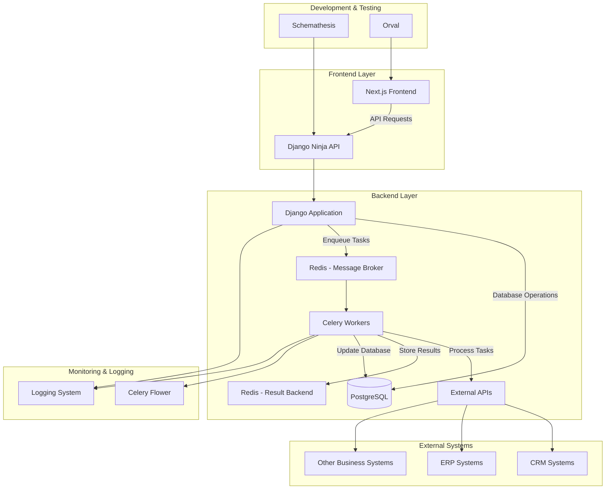
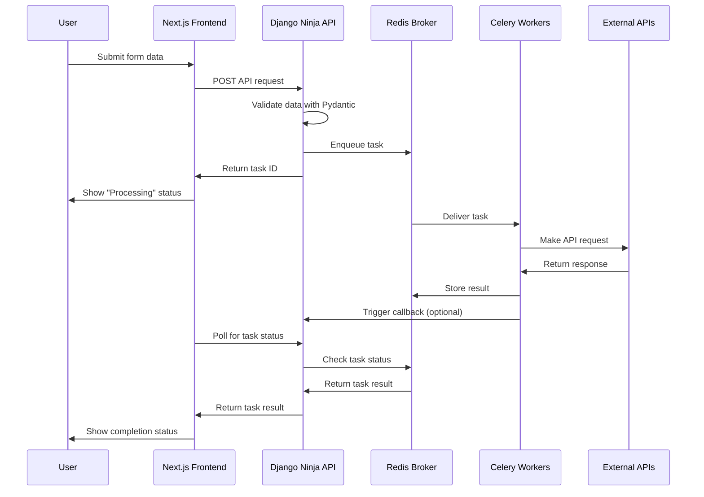
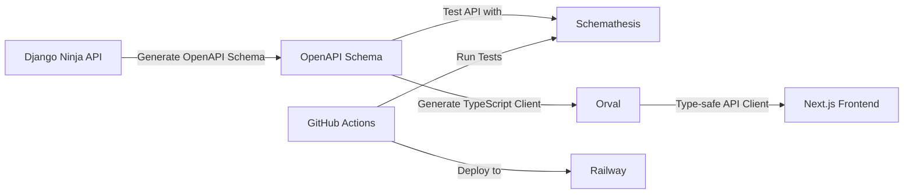

# Architecture Plan: Django + Next.js + Celery + Redis Integration

## System Architecture Overview

This architecture integrates Django with Django Ninja for the backend API, Next.js for the frontend, Celery for asynchronous task processing, and Redis as both a message broker and result backend.



## Component Details

### 1. Django Backend with Django Ninja

Django Ninja will serve as the API framework, offering:

- FastAPI-like experience with automatic OpenAPI/Swagger generation
- Type hints and validation using pydantic models
- Automatic serialization/deserialization
- Authentication and permissions
- API versioning

### 2. Next.js Frontend with Orval

The Next.js frontend will use Orval to:

- Generate type-safe API clients from OpenAPI specs
- Integrate with React Query for data fetching and caching
- Provide user-facing forms and workflows
- Handle client-side validation

### 3. Celery Task Queue

Celery will manage asynchronous tasks:

- Processing external API requests to business systems
- Handling retries and failures
- Managing task priorities and scheduling
- Providing task status and results

### 4. Redis

Redis will serve dual purposes:

- Message broker for Celery tasks
- Result backend for storing task outcomes

## Data Flow



## Development Workflow



## Directory Structure

```
project_root/
│
├── backend/                  # Django project
│   ├── manage.py
│   ├── mysite/               # Django project settings
│   ├── api/                  # Django Ninja API app
│   │   ├── api.py            # Main API router
│   │   ├── schemas/          # Pydantic schemas
│   │   └── endpoints/        # API endpoints by feature
│   ├── integrations/         # Business integrations app
│   ├── tasks/                # Celery tasks app
│   └── core/                 # Core functionality app
│
├── frontend/                 # Next.js project
│   ├── pages/
│   ├── components/
│   ├── lib/
│   │   ├── api/              # Orval-generated API clients
│   │   └── hooks/            # React Query hooks
│   ├── public/
│   └── styles/
│
├── docker/                   # Docker configuration
│   ├── docker-compose.yml
│   ├── Dockerfile.django
│   ├── Dockerfile.nextjs
│   └── Dockerfile.celery
│
├── .github/                  # GitHub Actions workflows
│   └── workflows/
│       ├── test.yml
│       └── deploy.yml
│
└── docs/                     # Documentation
```

## Best Practices and Standards

### Django Ninja Best Practices

1. **API Design**
   - Organize endpoints by feature or resource
   - Use Pydantic schemas for request/response validation
   - Implement proper authentication and permissions
   - Version your APIs (e.g., `/api/v1/`)
   - Use meaningful HTTP status codes

2. **Schema Design**
   - Create separate input and output schemas
   - Use inheritance for common fields
   - Leverage Pydantic validators for complex validation
   - Document schemas with descriptive comments

3. **Testing with Schemathesis**
   - Set up property-based testing for API endpoints
   - Test edge cases and error handling
   - Validate response schemas against OpenAPI spec
   - Integrate tests into CI/CD pipeline

4. **Security**
   - Implement proper authentication (JWT, OAuth)
   - Use HTTPS for all communications
   - Validate all user inputs with Pydantic
   - Store secrets in environment variables

### Celery Best Practices

1. **Task Design**
   - Keep tasks small and focused
   - Make tasks idempotent when possible
   - Use proper retry mechanisms with exponential backoff
   - Set appropriate timeouts for tasks

2. **Configuration**
   - Use dedicated queues for different types of tasks
   - Configure task priorities based on business needs
   - Set appropriate concurrency levels for workers
   - Implement proper error handling and logging

3. **Monitoring**
   - Use Celery Flower for monitoring task execution
   - Set up alerts for failed tasks
   - Monitor queue lengths to detect bottlenecks
   - Implement proper logging for task execution

### Next.js and Orval Best Practices

1. **API Integration**
   - Generate API clients with Orval from OpenAPI specs
   - Use React Query for data fetching and caching
   - Implement proper error handling
   - Set up automatic re-fetching and invalidation

2. **Type Safety**
   - Leverage TypeScript throughout the frontend
   - Use generated types from Orval
   - Create proper interfaces for component props
   - Implement proper error boundaries

3. **Performance**
   - Use static generation (SSG) when possible
   - Implement incremental static regeneration for dynamic content
   - Optimize images using Next.js Image component
   - Implement code splitting and lazy loading

4. **State Management**
   - Use React Query for server state
   - Consider using Context API or Redux for complex client state
   - Implement proper loading and error states
   - Use SWR or React Query for data fetching

## Development Environment Setup

1. **Local Development**
   - Use Docker Compose for local development
   - Set up hot reloading for both Django and Next.js
   - Use environment variables for configuration
   - Implement proper volume mounting for code changes

2. **Docker Configuration**
   - Create separate Dockerfiles for each component
   - Use multi-stage builds for production images
   - Optimize image size and build time
   - Use environment variables for configuration

3. **Database Setup**
   - Use PostgreSQL for development and production
   - Set up proper migrations
   - Use fixtures for initial data
   - Implement proper backup and restore procedures

## CI/CD and Deployment

1. **GitHub Actions Workflow**
   - Run tests on pull requests
   - Build and push Docker images
   - Deploy to Railway on merge to main
   - Notify on success/failure

2. **Railway Deployment**
   - Set up separate services for Django, Celery, and Next.js
   - Configure environment variables
   - Set up proper scaling
   - Implement proper logging and monitoring

3. **Monitoring and Logging**
   - Use Railway's built-in logging
   - Set up proper error tracking (Sentry)
   - Implement health checks
   - Monitor system resources

## Implementation Steps

1. **Initial Setup**
   - Set up Django project with Django Ninja
   - Configure PostgreSQL database
   - Set up Next.js project with TypeScript
   - Configure Docker and Docker Compose

2. **API Development**
   - Define Pydantic schemas
   - Implement API endpoints
   - Set up authentication and permissions
   - Generate OpenAPI schema

3. **Frontend Development**
   - Generate API clients with Orval
   - Implement React Query hooks
   - Create forms and workflows
   - Implement proper error handling

4. **Celery Integration**
   - Set up Redis as broker and result backend
   - Define Celery tasks
   - Implement proper error handling and retries
   - Set up Celery Flower for monitoring

5. **Testing**
   - Set up Schemathesis for API testing
   - Implement unit tests for Django
   - Set up Jest for frontend testing
   - Implement end-to-end tests

6. **CI/CD and Deployment**
   - Set up GitHub Actions workflows
   - Configure Railway deployment
   - Set up proper environment variables
   - Implement proper logging and monitoring

## Automation Opportunities

1. **API Development**
   - Automatic OpenAPI schema generation with Django Ninja
   - Type-safe API client generation with Orval
   - Automatic validation with Pydantic
   - Property-based testing with Schemathesis

2. **Frontend Development**
   - Type-safe API clients with Orval
   - Automatic form validation based on API schemas
   - Code generation for repetitive components
   - Automatic testing with Jest and React Testing Library

3. **Deployment**
   - Automatic testing and deployment with GitHub Actions
   - Automatic scaling with Railway
   - Automatic database migrations
   - Automatic rollbacks on failure

4. **Monitoring**
   - Automatic alerts for failed tasks
   - Automatic error tracking with Sentry
   - Automatic performance monitoring
   - Automatic log aggregation