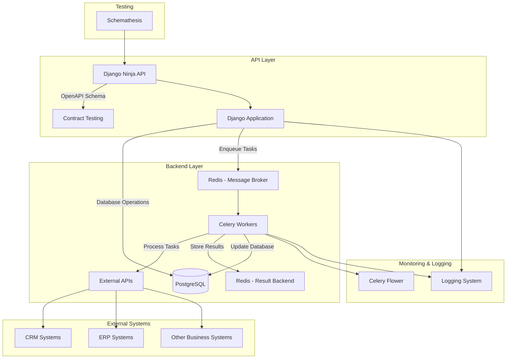
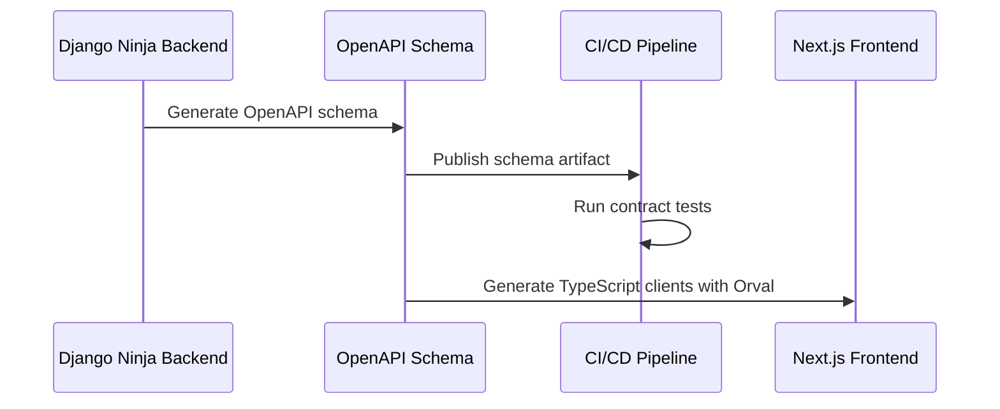

# Backend Architecture: Django + Django Ninja + Celery + Redis

This document outlines the backend architecture for a system that integrates Django with Django Ninja for API development, Celery for asynchronous task processing, and Redis as both a message broker and result backend. The architecture is designed for a multi-repo approach with contract testing between the Django backend and Next.js frontend.

## System Architecture Overview



## Component Details

### 1. Django with Django Ninja

Django Ninja will serve as the API framework, offering:

- FastAPI-like experience with automatic OpenAPI/Swagger generation
- Type hints and validation using pydantic models
- Automatic serialization/deserialization
- Authentication and permissions
- API versioning

Key benefits for a multi-repo approach:
- Automatic OpenAPI schema generation for contract testing
- Clear API boundaries for frontend integration
- Type safety with Pydantic models

### 2. Celery Task Queue

Celery will manage asynchronous tasks:

- Processing external API requests to business systems (CRM, ERP, etc.)
- Handling retries and failures
- Managing task priorities and scheduling
- Providing task status and results

### 3. Redis

Redis will serve dual purposes:

- Message broker for Celery tasks
- Result backend for storing task outcomes

## API Contract Management

Since we're using a multi-repo approach, managing the API contract between the Django backend and Next.js frontend is crucial:



### Implementation Strategy

1. **OpenAPI Schema Generation**
   - Automatically generate OpenAPI schema from Django Ninja
   - Version the schema with semantic versioning
   - Publish the schema as an artifact in CI/CD

2. **Contract Testing**
   - Use Schemathesis to test the API against its schema
   - Implement schema validation in CI/CD pipeline
   - Ensure backward compatibility for non-breaking changes

3. **Schema Distribution**
   - Set up a process for sharing the schema with the frontend repo
   - Options include:
     - Publishing to a package registry
     - Storing in a shared artifact repository
     - Including in API documentation

4. **API Versioning**
   - Implement explicit API versioning (e.g., `/api/v1/`)
   - Document breaking vs. non-breaking changes
   - Maintain backward compatibility when possible

## Directory Structure

```
backend/                  # Django project root
├── manage.py
├── mysite/               # Django project settings
├── api/                  # Django Ninja API app
│   ├── api.py            # Main API router
│   ├── schemas/          # Pydantic schemas
│   │   ├── __init__.py
│   │   ├── common.py     # Shared schema components
│   │   ├── requests.py   # Request schemas
│   │   └── responses.py  # Response schemas
│   └── endpoints/        # API endpoints by feature
│       ├── __init__.py
│       ├── auth.py
│       └── integrations.py
├── integrations/         # Business integrations app
│   ├── __init__.py
│   ├── models.py
│   ├── services/         # Integration services
│   │   ├── __init__.py
│   │   ├── crm.py
│   │   └── erp.py
│   └── tests/
├── tasks/                # Celery tasks app
│   ├── __init__.py
│   ├── celery.py         # Celery configuration
│   ├── tasks.py          # Task definitions
│   └── tests/
├── core/                 # Core functionality app
│   ├── __init__.py
│   ├── models.py
│   └── utils.py
├── tests/                # Project-level tests
│   ├── __init__.py
│   ├── conftest.py
│   └── contract/         # Contract tests
│       ├── __init__.py
│       └── test_api_schema.py
├── docker/               # Docker configuration
│   ├── docker-compose.yml
│   ├── Dockerfile.django
│   └── Dockerfile.celery
└── scripts/              # Utility scripts
    ├── generate_schema.py
    └── publish_schema.sh
```

## Best Practices and Standards

### Django Ninja Best Practices

1. **API Design**
   - Organize endpoints by feature or resource
   - Use Pydantic schemas for request/response validation
   - Implement proper authentication and permissions
   - Version your APIs (e.g., `/api/v1/`)
   - Use meaningful HTTP status codes

2. **Schema Design**
   - Create separate input and output schemas
   - Use inheritance for common fields
   - Leverage Pydantic validators for complex validation
   - Document schemas with descriptive comments

3. **Testing with Schemathesis**
   - Set up property-based testing for API endpoints
   - Test edge cases and error handling
   - Validate response schemas against OpenAPI spec
   - Integrate tests into CI/CD pipeline

4. **Security**
   - Implement proper authentication (JWT, OAuth)
   - Use HTTPS for all communications
   - Validate all user inputs with Pydantic
   - Store secrets in environment variables

### Celery Best Practices

1. **Task Design**
   - Keep tasks small and focused
   - Make tasks idempotent when possible
   - Use proper retry mechanisms with exponential backoff
   - Set appropriate timeouts for tasks

2. **Configuration**
   - Use dedicated queues for different types of tasks
   - Configure task priorities based on business needs
   - Set appropriate concurrency levels for workers
   - Implement proper error handling and logging

3. **Monitoring**
   - Use Celery Flower for monitoring task execution
   - Set up alerts for failed tasks
   - Monitor queue lengths to detect bottlenecks
   - Implement proper logging for task execution

4. **Performance**
   - Use task batching for similar operations
   - Consider using task routing for specialized workers
   - Optimize task serialization (use JSON instead of pickle)
   - Use result expiration to prevent Redis memory issues

### Redis Best Practices

1. **Configuration**
   - Enable persistence for important data
   - Configure appropriate memory limits
   - Use Redis Sentinel or Redis Cluster for high availability
   - Implement proper backup strategies

2. **Usage**
   - Use Redis for caching frequently accessed data
   - Set appropriate TTLs for cached data
   - Use Redis data structures effectively (lists, sets, sorted sets)
   - Monitor Redis memory usage

## Development Environment Setup

1. **Local Development**
   - Use Docker Compose for local development
   - Set up hot reloading for Django
   - Use environment variables for configuration
   - Implement proper volume mounting for code changes

2. **Docker Configuration**
   ```yaml
   # docker-compose.yml
   version: '3.8'
   
   services:
     db:
       image: postgres:14
       environment:
         - POSTGRES_DB=mydb
         - POSTGRES_USER=myuser
         - POSTGRES_PASSWORD=mypassword
       volumes:
         - postgres_data:/var/lib/postgresql/data/
       ports:
         - "5432:5432"
   
     redis:
       image: redis:7
       ports:
         - "6379:6379"
   
     web:
       build:
         context: .
         dockerfile: docker/Dockerfile.django
       command: python manage.py runserver 0.0.0.0:8000
       volumes:
         - .:/app
       ports:
         - "8000:8000"
       depends_on:
         - db
         - redis
       environment:
         - PGDATABASE=mydb
         - PGUSER=myuser
         - PGPASSWORD=mypassword
         - PGHOST=db
         - PGPORT=5432
         - REDIS_URL=redis://redis:6379/0
   
     celery:
       build:
         context: .
         dockerfile: docker/Dockerfile.celery
       command: celery -A tasks worker --loglevel=info
       volumes:
         - .:/app
       depends_on:
         - db
         - redis
       environment:
         - PGDATABASE=mydb
         - PGUSER=myuser
         - PGPASSWORD=mypassword
         - PGHOST=db
         - PGPORT=5432
         - REDIS_URL=redis://redis:6379/0
   
     celery-beat:
       build:
         context: .
         dockerfile: docker/Dockerfile.celery
       command: celery -A tasks beat --loglevel=info
       volumes:
         - .:/app
       depends_on:
         - db
         - redis
       environment:
         - PGDATABASE=mydb
         - PGUSER=myuser
         - PGPASSWORD=mypassword
         - PGHOST=db
         - PGPORT=5432
         - REDIS_URL=redis://redis:6379/0
   
     flower:
       build:
         context: .
         dockerfile: docker/Dockerfile.celery
       command: celery -A tasks flower --port=5555
       ports:
         - "5555:5555"
       depends_on:
         - celery
       environment:
         - REDIS_URL=redis://redis:6379/0
   
   volumes:
     postgres_data:
   ```

3. **Database Setup**
   - Use PostgreSQL for development and production
   - Set up proper migrations
   - Use fixtures for initial data
   - Implement proper backup and restore procedures

## CI/CD and Deployment

1. **GitHub Actions Workflow**
   ```yaml
   # .github/workflows/test-and-deploy.yml
   name: Test and Deploy
   
   on:
     push:
       branches: [ main ]
     pull_request:
       branches: [ main ]
   
   jobs:
     test:
       runs-on: ubuntu-latest
       
       services:
         postgres:
           image: postgres:14
           env:
             POSTGRES_DB: test_db
             POSTGRES_USER: test_user
             POSTGRES_PASSWORD: test_password
           ports:
             - 5432:5432
           options: >-
             --health-cmd pg_isready
             --health-interval 10s
             --health-timeout 5s
             --health-retries 5
         
         redis:
           image: redis:7
           ports:
             - 6379:6379
           options: >-
             --health-cmd "redis-cli ping"
             --health-interval 10s
             --health-timeout 5s
             --health-retries 5
       
       steps:
         - uses: actions/checkout@v3
         
         - name: Set up Python
           uses: actions/setup-python@v4
           with:
             python-version: '3.10'
             
         - name: Install dependencies
           run: |
             python -m pip install --upgrade pip
             pip install -r requirements.txt
             pip install pytest pytest-django schemathesis
             
         - name: Run tests
           env:
             PGDATABASE: test_db
             PGUSER: test_user
             PGPASSWORD: test_password
             PGHOST: localhost
             PGPORT: 5432
             REDIS_URL: redis://localhost:6379/0
           run: |
             pytest
             
         - name: Generate OpenAPI schema
           run: |
             python scripts/generate_schema.py
             
         - name: Run contract tests
           run: |
             schemathesis run --checks all http://localhost:8000/api/schema.json
             
         - name: Upload schema artifact
           uses: actions/upload-artifact@v3
           with:
             name: openapi-schema
             path: openapi-schema.json
     
     deploy:
       needs: test
       if: github.ref == 'refs/heads/main'
       runs-on: ubuntu-latest
       
       steps:
         - uses: actions/checkout@v3
         
         - name: Install Railway CLI
           run: npm install -g @railway/cli
           
         - name: Deploy to Railway
           env:
             RAILWAY_TOKEN: ${{ secrets.RAILWAY_TOKEN }}
           run: railway up
   ```

2. **Railway Deployment**
   - Set up separate services for Django and Celery
   - Configure environment variables
   - Set up proper scaling
   - Implement proper logging and monitoring

3. **Monitoring and Logging**
   - Use Railway's built-in logging
   - Set up proper error tracking (Sentry)
   - Implement health checks
   - Monitor system resources

## Contract Testing Implementation

1. **Generate OpenAPI Schema**
   ```python
   # scripts/generate_schema.py
   import json
   import os
   import sys
   import django
   
   # Set up Django
   sys.path.append(os.path.dirname(os.path.dirname(os.path.abspath(__file__))))
   os.environ.setdefault("DJANGO_SETTINGS_MODULE", "mysite.settings")
   django.setup()
   
   # Import the API
   from api.api import api
   
   # Generate the OpenAPI schema
   schema = api.get_openapi_schema()
   
   # Write to file
   with open("openapi-schema.json", "w") as f:
       json.dump(schema, f, indent=2)
   
   print("OpenAPI schema generated successfully!")
   ```

2. **Schemathesis Testing**
   ```python
   # tests/contract/test_api_schema.py
   import pytest
   from schemathesis import from_path
   import os
   
   # Path to the OpenAPI schema
   schema_path = os.path.join(os.path.dirname(os.path.dirname(os.path.dirname(__file__))), "openapi-schema.json")
   
   # Load the schema
   schema = from_path(schema_path)
   
   # Generate test cases for all endpoints
   @schema.parametrize()
   def test_api(case):
       # Run the test case
       response = case.call()
       
       # Validate the response
       case.validate_response(response)
   ```

3. **Publish Schema Script**
   ```bash
   #!/bin/bash
   # scripts/publish_schema.sh
   
   # Generate the schema
   python scripts/generate_schema.py
   
   # Publish to a location accessible by the frontend repo
   # This could be an artifact repository, S3 bucket, etc.
   # For example, using AWS S3:
   # aws s3 cp openapi-schema.json s3://my-bucket/api-schemas/openapi-schema-$(date +%Y%m%d%H%M%S).json
   # aws s3 cp openapi-schema.json s3://my-bucket/api-schemas/openapi-schema-latest.json
   
   echo "Schema published successfully!"
   ```

## Implementation Steps

1. **Initial Setup**
   - Set up Django project with Django Ninja
   - Configure PostgreSQL database
   - Set up Docker and Docker Compose

2. **API Development**
   - Define Pydantic schemas
   - Implement API endpoints
   - Set up authentication and permissions
   - Generate OpenAPI schema

3. **Celery Integration**
   - Set up Redis as broker and result backend
   - Define Celery tasks
   - Implement proper error handling and retries
   - Set up Celery Flower for monitoring

4. **Testing**
   - Set up Schemathesis for API testing
   - Implement unit tests for Django
   - Set up contract testing
   - Integrate tests into CI/CD pipeline

5. **CI/CD and Deployment**
   - Set up GitHub Actions workflows
   - Configure Railway deployment
   - Set up proper environment variables
   - Implement proper logging and monitoring

6. **Contract Testing**
   - Implement schema generation
   - Set up Schemathesis tests
   - Create schema publishing process
   - Document API versioning strategy

## Automation Opportunities

1. **API Development**
   - Automatic OpenAPI schema generation with Django Ninja
   - Automatic validation with Pydantic
   - Property-based testing with Schemathesis
   - Automatic documentation generation

2. **Deployment**
   - Automatic testing and deployment with GitHub Actions
   - Automatic scaling with Railway
   - Automatic database migrations
   - Automatic rollbacks on failure

3. **Monitoring**
   - Automatic alerts for failed tasks
   - Automatic error tracking with Sentry
   - Automatic performance monitoring
   - Automatic log aggregation